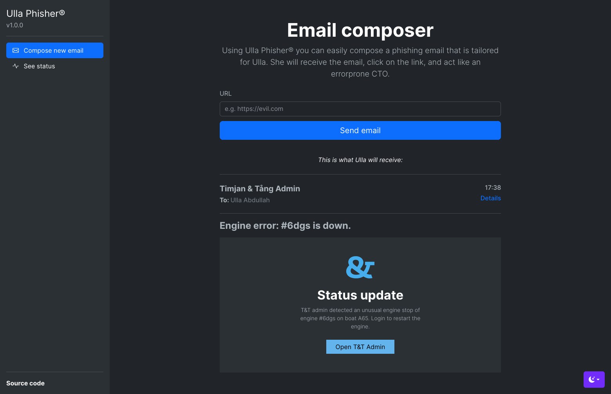

# oauthornot-admin-bot
A web server that takes URLs and mimicks if a SysAdmin would mistakenly click on that URL in a phishing email. 

**Part of the OAuthOrNot package.**



## Features
- Uses `multiprocessing`'s `Queue` to create a distributed task queue, like a simplified version of Celery
- Selenium Webdriver is used with the geckodriver to spawn sessions and configure safety features
- Integrates with the OAuth 2.0 flow of Github to log in users
- Flask and its Render templates are used to create a simple WSGI server

## Minimum environment requirements
- Python 3.10.8

## Installation
```bash
git clone https://github.com/sakerhetspolisen/oauthornot-admin-bot.git
```
Setup virtual environment:
```bash
python3 -m venv venv
source venv/bin/activate
```
Install requirements:
```bash
pip install -r requirements.txt
```
Download and run Selenium Manager to set geckodriver in `$PATH`:
```bash
curl -O https://github.com/SeleniumHQ/selenium/raw/trunk/common/manager/linux/selenium-manager
chmod +x selenium-manager
./selenium-manager --browser firefox
```
Create `.env` file in repository root, containing the following:
```
GITHUB_ADMIN_USER_USERNAME=<your_github_mock_admin_username>
GITHUB_ADMIN_USER_PASSWORD=<your_github_mock_admin_pwd>
```
Run `main.py`:
```
python3 main.py
```


## Contribute


So you want to contribute? Good, the world needs more brave troopers like you. Contributions are what makes the open-source community such an amazing place to learn, inspire, and create. Any contributions you make are greatly appreciated by us and the community.


- If you find a typo, bug or want to add a feature, create an issue or add a pull request with the code you want to add!


- Regarding bugs, please make sure that your issue is:


  - _Reproducible_. Include steps to reproduce the problem.


  - _Specific_. Include as much detail as possible: which device you use, how you have interacted with the website, etc.


  - _Scoped to a Single Bug_. One bug per issue.

