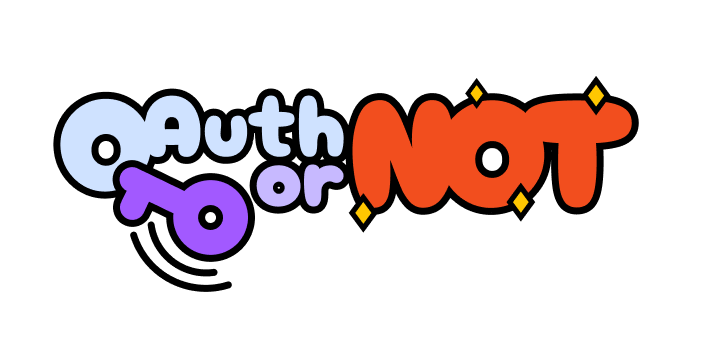

<h1>Bot for OAuthOrNot</h1>

<b>Native sharing if supported, beautiful fallback if not.</b>

A <code>~8kb</code> package for effortless social media sharing, originally forked from <a href="https://www.npmjs.com/package/react-web-share">react-web-share</a>.

  
  
  
  

